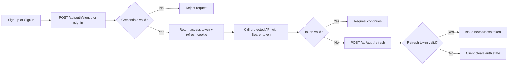
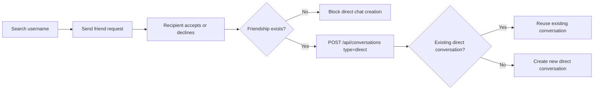
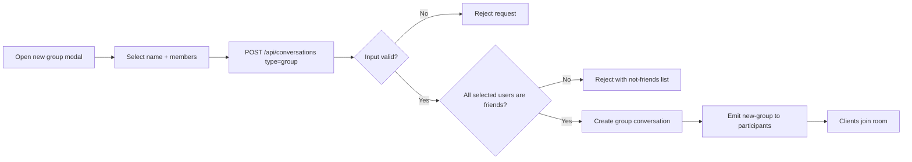
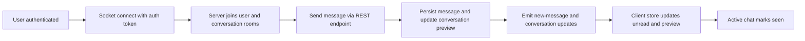
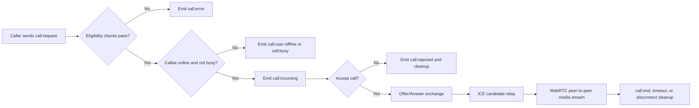

# RealtimeChatApp - Full-Stack Realtime Chat and Calling App

## Summary

RealtimeChatApp is a full-stack web application for real-time communication. It combines REST APIs, Socket.IO events, and WebRTC media streams to support authentication, friend discovery, direct/group chat, live presence, and browser-based audio/video calls.

This project is designed to demonstrate more than a happy-path chat demo: it includes explicit validation, protected boundaries, and edge-case handling around auth, messaging, and call lifecycles.

## Live Web App Deployment

Link: https://moji-realtime-chat.onrender.com/

## Table of Contents

- [Tech Stack](#tech-stack)
- [Why This Project Stands Out](#why-this-project-stands-out)
- [Architecture Overview](#architecture-overview)
- [Highlighted Features](#highlighted-features)
  - [1) Authentication and Session Lifecycle](#1-authentication-and-session-lifecycle)
  - [2) Friend Request to Direct Chat](#2-friend-request-to-direct-chat)
  - [3) Group Conversation Lifecycle](#3-group-conversation-lifecycle)
  - [4) Real-Time Messaging and Presence](#4-real-time-messaging-and-presence)
  - [5) Audio and Video Calling](#5-audio-and-video-calling)
- [Setup and Run](#setup-and-run)
- [Project Structure](#project-structure)
- [API and Realtime Notes](#api-and-realtime-notes)
- [Testing and Quality Signals](#testing-and-quality-signals)
- [Known Limitations and Future Improvements](#known-limitations-and-future-improvements)
- [Roadmap](#roadmap)

## Tech Stack

| Layer    | Technologies                                                     |
| -------- | ---------------------------------------------------------------- |
| Frontend | React 18, TypeScript, Vite, Tailwind CSS, Zustand, React Hook Form, Zod |
| Backend  | Node.js, Express, MongoDB, Mongoose, JWT, Multer                 |
| Realtime | Socket.IO (server + client)                                      |
| Calling  | WebRTC (`RTCPeerConnection`, offer/answer, ICE candidates), STUN |
| Docs     | Swagger UI (`/api-docs`)                                         |
| Testing  | Node test runner (`node --test`)                                 |
| Ops      | GitHub Actions CI, Docker                                        |

## Why This Project Stands Out

- Uses a hybrid architecture: REST for core CRUD flows plus Socket.IO for real-time state and signaling.
- Separates chat signaling and media transport correctly: Socket.IO for signaling, WebRTC for peer media.
- Implements reliability-focused edge-case handling (offline users, busy lines, unauthorized signaling, token expiry).
- Keeps backend organization aligned with layered responsibilities (`application`, `domain`, `infrastructure`).
- Includes backend automated tests for call lifecycle and domain policy behavior.

## Architecture Overview

```text
RealtimeChatApp/
├── backend/
│   ├── src/
│   │   ├── app/
│   │   ├── application/
│   │   │   ├── auth/
│   │   │   ├── call/
│   │   │   ├── chat/
│   │   │   ├── friend/
│   │   │   └── user/
│   │   ├── controllers/
│   │   ├── domain/
│   │   │   ├── chat/
│   │   │   └── friend/
│   │   ├── infrastructure/
│   │   │   ├── media/
│   │   │   ├── persistence/
│   │   │   ├── realtime/
│   │   │   └── security/
│   │   ├── libs/
│   │   ├── middlewares/
│   │   ├── models/
│   │   ├── routes/
│   │   ├── shared/
│   │   ├── socket/
│   │   ├── utils/
│   │   ├── server.js
│   │   └── swagger.json
│   ├── tests/
│   ├── Dockerfile
│   ├── docker-compose.yml
│   └── package.json
├── frontend/
│   ├── src/
│   │   ├── assets/
│   │   ├── components/
│   │   ├── features/
│   │   │   └── call/
│   │   ├── hooks/
│   │   ├── pages/
│   │   ├── services/
│   │   ├── stores/
│   │   ├── types/
│   │   ├── App.tsx
│   │   └── main.tsx
│   ├── public/
│   └── package.json
└── docs/
    └── superpowers/
```

Why this structure was chosen:

- Backend layers keep transport concerns (`routes`, `controllers`) separate from use-case orchestration (`application`) and business rules (`domain`).
- Infrastructure concerns (persistence, security, realtime adapters) are isolated from business workflows.
- Frontend separates route-level screens (`pages`), reusable UI (`components`), state coordination (`stores`), and API calls (`services`).
- The call feature is isolated under `frontend/src/features/call` because WebRTC + signaling logic has a different complexity profile than regular chat UI.

## Highlighted Features

### 1) Authentication and Session Lifecycle

What it does:

- Supports sign up, sign in, sign out, and refresh token flows.
- Protects private API routes with JWT-based middleware.
- Keeps client auth state synchronized with session validity.

How it works:



Edge cases handled:

- Missing access token on private routes returns `401`.
- Invalid or expired access token returns `403`.
- Missing/expired refresh token triggers session reset on the client.

Why it matters: auth boundaries are explicit and fail safely instead of leaving stale client sessions.

### 2) Friend Request to Direct Chat

What it does:

- Lets users search by username and send friend requests.
- Supports accepting/declining requests.
- Creates (or reuses) direct conversations between valid friends.

How it works:



Edge cases handled:

- Friendship checks block direct-chat creation when users are not connected.
- Invalid payloads are rejected before conversation creation.
- Existing direct conversations are reused to avoid duplicates.

Why it matters: the relationship model stays consistent and avoids duplicate direct chat threads.

### 3) Group Conversation Lifecycle

What it does:

- Creates group conversations with selected members.
- Validates group payloads before persistence.
- Broadcasts new group availability to participants in real time.

How it works:



Edge cases handled:

- Missing group name or invalid member list is rejected by conversation input policy.
- Non-friend members are blocked by friendship checks.
- Participants receive real-time updates for newly created groups.

Why it matters: group creation enforces social constraints and keeps client state synchronized.

### 4) Real-Time Messaging and Presence

What it does:

- Connects authenticated users to Socket.IO.
- Tracks online users and room membership.
- Delivers new message, unread-count, and seen-status updates in real time.

How it works:



Edge cases handled:

- If a socket event arrives for a missing conversation, client auto-syncs conversations before applying updates.
- Empty message input is rejected unless image content exists.
- Group message send is blocked when user is not a group member.

Why it matters: users get immediate updates without sacrificing server-side validation.

### 5) Audio and Video Calling

What it does:

- Supports one-to-one audio/video calls between eligible users.
- Uses Socket.IO for call signaling and WebRTC for media.
- Handles call lifecycle states: request, accept/reject, in-call, timeout, end.

How it works:



Edge cases handled:

- Rejects self-calls.
- Rejects calls when callee is offline.
- Rejects calls when either participant is already busy.
- Times out unanswered calls and clears call session state.
- Rejects unauthorized offer/answer/ICE signaling from non-participants.
- Ends active calls and notifies peers when one side disconnects.
- Rejects calls when users are not friends or conversation context is invalid.

Why it matters: real-time calling remains predictable under failure and abuse scenarios, not only ideal conditions.

## Setup and Run

### Prerequisites

- Node.js 20+ (recommended)
- npm
- MongoDB instance (Atlas or local), with a valid connection string

### 1) Install dependencies

```bash
npm install --prefix backend
npm install --prefix frontend
```

### 2) Configure environment files

```bash
cp backend/.env.example backend/.env
cp frontend/.env.example frontend/.env.development
```

Backend required values include:

- `MONGODB_CONNECTIONSTRING`
- `ACCESS_TOKEN_SECRET`
- `CLIENT_URL`

Frontend required values include:

- `VITE_API_URL`
- `VITE_SOCKET_URL`
- `VITE_CALL_FEATURE_ENABLED`

### 3) Run backend and frontend

```bash
npm run dev --prefix backend
npm run dev --prefix frontend
```

### 4) Verify local environment

- Backend health: `http://localhost:5001/health`
- API docs: `http://localhost:5001/api-docs`
- Frontend: `http://localhost:5173`

### Optional: run backend with Docker

```bash
docker build -t realtime-chat-backend ./backend
docker run --rm -p 5001:5001 --env-file backend/.env realtime-chat-backend
```

## Project Structure

### Backend focus areas

- `backend/src/controllers`: HTTP adapters for route handlers.
- `backend/src/application`: use-case orchestration for auth, chat, friend, call, and user flows.
- `backend/src/domain`: domain policies and reusable business rules.
- `backend/src/infrastructure`: persistence, security, realtime, and media integrations.
- `backend/src/socket`: Socket.IO setup, call signaling, call session management.
- `backend/tests`: backend automated tests for call lifecycle and domain behavior.

### Frontend focus areas

- `frontend/src/pages`: route-level screens (`SignInPage`, `SignUpPage`, `ChatAppPage`).
- `frontend/src/components`: reusable UI and feature components.
- `frontend/src/features/call`: call state, signaling hooks, and WebRTC services.
- `frontend/src/services`: API client modules for auth/chat/friend/user.
- `frontend/src/stores`: global state with Zustand (auth, chat, socket, theme, user).
- `frontend/src/types`: shared TypeScript contracts.

## API and Realtime Notes

Core REST route groups:

- `/api/auth` - sign up, sign in, sign out, refresh
- `/api/users` - profile, search, avatar upload
- `/api/friends` - requests, accept/decline, list, remove
- `/api/messages` - direct/group send and image upload
- `/api/conversations` - create/list/messages/seen/clear

Realtime events in active use include:

- Presence and chat: `online-users`, `new-message`, `read-message`, `new-group`
- Calling: `call:request`, `call:incoming`, `call:accept`, `call:reject`, `call:offer`, `call:answer`, `call:ice-candidate`, `call:end`, `call:error`, `call:timeout`, `call:busy`, `call:user-offline`, `call:ended`

## Testing and Quality Signals

Run backend tests:

```bash
npm test --prefix backend
```

CI automation:

- `.github/workflows/ci.yml` runs on `push` and `pull_request`.
- Backend job installs dependencies and runs `npm test` in `backend/`.
- Frontend job installs dependencies, runs `npm run lint`, then `npm run build` in `frontend/`.

Current backend test coverage includes:

- `backend/tests/call-socket.test.js` - call signaling lifecycle and edge-case behavior
- `backend/tests/call-use-cases.test.js` - call eligibility validation logic
- `backend/tests/domain-chat-policy.test.js` - message and conversation input policy behavior
- `backend/tests/domain-friend-utils.test.js` - friend-domain utility behavior
- `backend/tests/uploadMiddleware.test.js` - upload middleware safeguards

Current gap:

- Frontend automated tests are not present in the current repository structure.

## Known Limitations and Future Improvements

- Call session state is managed in memory on the backend (`callSessionStore`), which is not horizontally scalable by itself.
- WebRTC config currently uses STUN only; production-grade NAT traversal usually needs TURN as well.
- Frontend lacks automated test coverage for auth/chat/call flows.
- Deployment pipeline and environment promotion docs are not yet formalized in this README.

## Roadmap

- Add TURN integration and stronger reconnect handling for calling.
- Introduce frontend integration tests for auth, messaging, and call journeys.
- Move realtime call/session state to distributed storage for multi-instance deployments.
- Add end-to-end test scenarios for friend request -> direct chat -> call lifecycle.
- Expand operational docs (deployment, observability, incident/debug playbooks).
